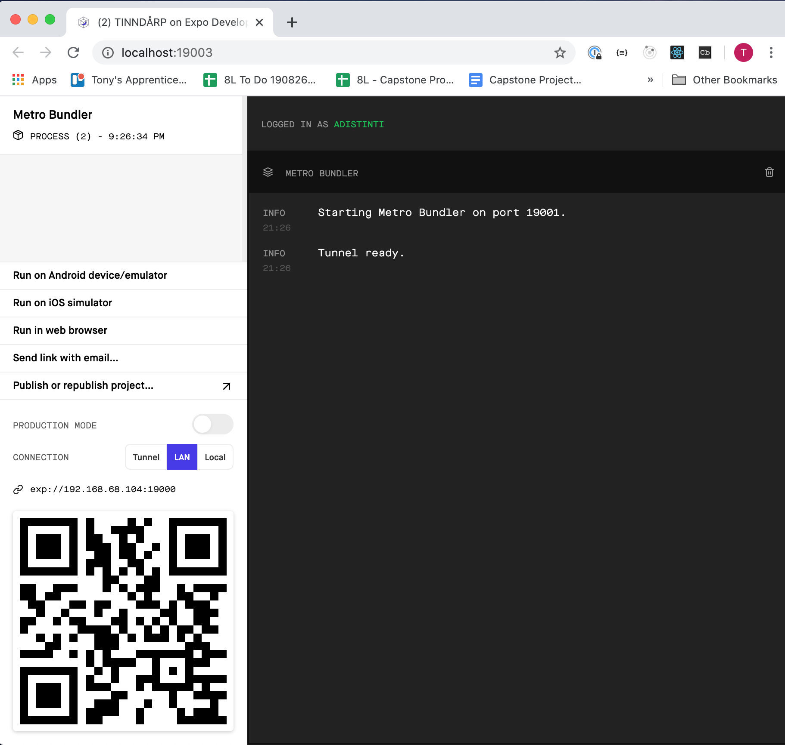

# TINNDÅRP for iOS 

TINNDÅRP is a [React Native](https://reactnative.dev/docs/getting-started) app built with an [Expo](https://docs.expo.io/versions/latest/) workflow. Its build is handled by [Travis CI](https://docs.travis-ci.com/). Unit tests rely on [Jest](https://jestjs.io/) and [Enzyme](https://enzymejs.github.io/enzyme/).

The repo can be found on GitHub [here](https://github.com/breadoliveoilsalt/TINNDARPiOS).

## Introduction to Expo

In the discussion of Expo below, references to the "app" refer to TINNDÅRP or another app built with Expo, not Expo itself.

Expo is a tool for developing, building, and deploying React Native applications, with the goal of making the overall process easier.  Expo offers different two flavors of workflow with which to develop an app -- "bare" and "managed" -- each offering different functionality and tools. See [here](https://docs.expo.io/versions/latest/introduction/managed-vs-bare/) for a comparison between the two.  

TINNDÅRP was built using Expo's "managed workflow."  There are tradeoffs to this approach. For example, the downsides include:

  - an app built with with this workflow cannot contain native languages such as Swift (only JavaScript/JSX);
  - it cannot be opened in Xcode; and 
  - it cannot be opened in an iOS Simulator directly.  

On the plus side, this workflow provides:

  - a developer tool to manage the process of opening the app in an iOS Simulator, or opening the app as a browser-based, debuggable application, in a quick and easy fashion, with real time updates as the code changes;
  - access to an iOS Expo Client App on an iPhone or iPad, to experience the app on one of these devices as it is being built, so long as the device is on the same network as the computer running the Expo Developer Tool; and
  - a Expo-managed website that allows a user or tester to play with the app via a web browser without having to download the app from the Apple Store and without the installation steps below.  

These methods of accessing TINNDÅRP are described below.   

# Requirements

- Node 13.13.0
- Yarn >= 1.15.2
- [Xcode](https://apps.apple.com/us/app/xcode/id497799835?mt=12), which includes iOS Simulators.
- Expo CLI >= 13.18.6 (installation described below)
- The [Expo Client App](https://apps.apple.com/app/apple-store/id982107779), *if* you want to run TINNDÅRP on your own iPhone or iPad while running Expo's web-based Developer Tool (the "Expo DevTool"), described below. You will need to download the Expo Client App to your iPhone or iPad from the Apple Store and sign up for an Expo account.

# Installing and running the app locally:

1. Clone [the repository](https://github.com/breadoliveoilsalt/TINNDARPiOS).  `cd` into the root directory (e.g. `cd TINNDARPiOS`)
2. Install dependencies by running `yarn install`.
  - Note: The Expo CLI dependency is included in `package.json` and should be installed via `yarn install`.  But if you have trouble with any of the commands below, you may need to install the Expo CLI globally by running `npm install -g expo-cli`
  - Note: The Expo and Expo CLI dependencies are large.  Installation may take some time.
3. Run `yarn start`
  - This starts up the web-based Expo DevTool, which leans on Metro Bundler.  It looks like this:

 

  - The Expo DevTool above should open up automatically in a browser, but if not (or if you close your browser window by accident), the dev tool is available at `http://localhost:19002/`.
  - Once the Expo DevTool is running, there are several options to launch TINNDÅRP:
    - If you click "Run on iOS simulator" on the left, a Simulator should appear and launch TINNDÅRP.
      - Running `yarn ios` from the command line also provides a way of launching the app directly in a Simulator.
      - Similar to running TINNDÅRP on your iPhone or iPad as described below, an iOS Simulator runs TINNDÅRP through another app installed on the Simulator - the Expo Client App.  So if you hit the home screen on the Simulator and cannot find TINNDÅRP, simply click on the Expo Client App on the Simulator.

 

  - If you want to launch TINNDÅRP on your iPhone or iPad, download the [Expo Client App](https://apps.apple.com/app/apple-store/id982107779) from the Apple Store and sign up for an Expo account.  Make sure your iOS device is on the same network as your computer running the Expo DevTool.  Open your camera and scan the QR code in the lower left corner of the Expo DevTool.  This should trigger prompts that allow you to open up TINNDÅRP as an app on your iOS device through the Expo Client App. 

# Running tests

Unit tests were written using Jest and Enzyme.

* To run tests in Jest's interactive mode, from the app's root directory, run `yarn test`.

* To run tests without interactive mode, from the app's root directory, run `yarn test:plain`.

# Deploys

Deploys, accessible through the instructions immediately below, are handled by Travis CI when a GitHub branch is merged into the master branch.

# Accessing the built app without local installations

Expo's managed workflow provides a way to experience TINNDÅRP via a web browser without having to take the installation steps above and without having to use the Expo DevTool.  There are a few tradeoffs, however:
  - the app is opened in a virtual *Android* device, not an iOS device, and 
  - for unpaid accounts, the user may have to wait in a queue for the app to be built virtually.

TINNDÅRP's CI/CD process, handled by Travis CI, deploys TINNDÅRP to this web-based platform.

To access TINNDÅRP in this manner, go [here](https://expo.io/@adistinti/TINNDARPiOS) to reach the Expo page hosting the app. 

 

On the right, under the QR code, click "Open project in the browser."

 

If there is an "Appetize code" pop up, click "Open project" without entering a code.

 

A virtual Android device will load. Click "Tap to play".

 

Unfortunately, since we are not paying for anything here, you might have to wait if the screen indicates that there are other virtual devices being built in the queue before you. 

 

When the app finishes building, the virtual Android device will be running the Expo Client App, similar to an actual iOS device.  Click on the screen, hold, and drag up until you see "Open project in Expo."  Click on that.

 

TINNDÅRP should appear. 

 

# Known Issues

- Formatting: The app was styled primarily using a simulated iPhone 8. If the styling looks off in an iOS Simulator, try loading an iPhone 8. The styling might look a bit off in the virtual Android device described above.

- Use of AsyncStorage and Jest warnings: For saving JSON Web Tokens locally, the app relies on the AsyncStorage module, as described in the [Expo docs](https://docs.expo.io/versions/latest/react-native/asyncstorage/). This requires importing AsyncStorage from React Native directly, but according to the React Native docs, AsyncStorage is depreciated with respect to the React Native core library and [must be imported from the React Native community](https://github.com/react-native-community/async-storage). As a result, you may see warnings when you run unit tests with Jest (via `yarn test`), such as this: 
 

 

As of April 2020, this is a known and unresolved issue with Expo.  Expo cannot link to the React Native community source if it is built with a "managed workflow," since this workflow does not allow extension of Expo's native module packages.  See, for example, [here](https://github.com/react-native-community/async-storage/issues/89), [here](https://github.com/react-native-community/async-storage/issues/304), and [here](https://stackoverflow.com/questions/56029007/nativemodule-asyncstorage-is-null-with-rnc-asyncstorage).  

- Only shallow rendering for unit tests: The unit tests are configured to use Enzyme and Jest via `package.json` and `/enzymeTestsSetup.js`, per [the Enzyme docs on React Native](https://enzymejs.github.io/enzyme/docs/guides/react-native.html). As the Enzyme docs admit, however, configuring Enzyme with a React Native app is notoriously troublesome.  For TINNDÅRP's unit tests, rendering a component with Enzyme's `shallow` function works fine.  Rendering a component with Enzyme's `mount` function is workable as well, but using `mount` causes all kinds of console warnings to appear when tests are run with Jest (via `yarn test`).  The common workaround is to put a script in a test setup file that effectively cancels the console-logged warnings when Jest runs its tests.  See [here](https://github.com/enzymejs/enzyme/issues/831), for example.  This approach made me nervous that I would miss other warnings that might arise in the tests, so TINNDÅRP's unit tests exclusively use Enzyme's `shallow` rendering.  The tradeoffs are that some of the tests are occasionally more verbose than they otherwise would be and/or require homegrown helper methods in order to use `shallow` exclusively.
